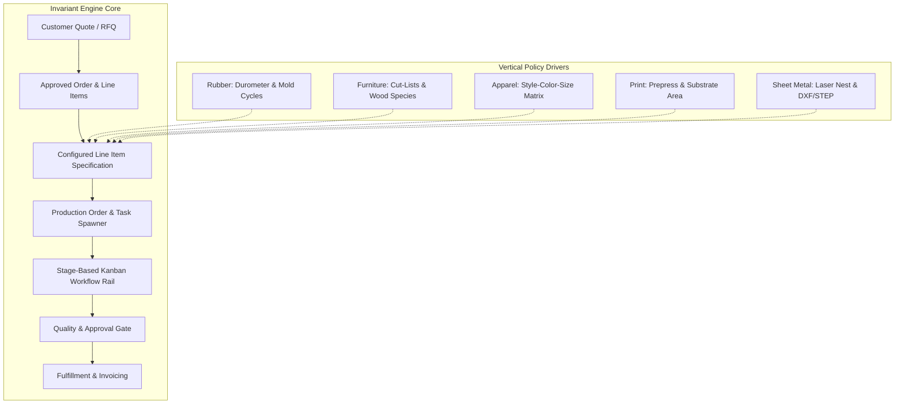
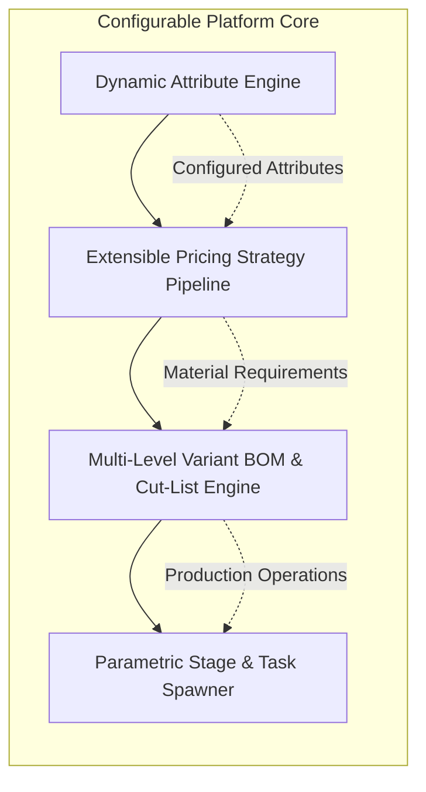

# Cross-Vertical MTO Manufacturing Workflows: Architectural Research & Comparison

## Executive Summary & Domain Scope

Make-to-Order (MTO) manufacturing spans diverse industrial domains, ranging from molded elastomeric products to bespoke architectural furniture, technical apparel, wide-format signage, and precision metal fabrications. While each industry exhibits distinct physical properties, regulatory standards, and production tooling, all MTO operations share a core structural invariant: **production execution is initiated only upon receipt of a binding customer order or approved quotation containing specific product configurations**.

This research note analyzes cross-vertical MTO manufacturing workflows to establish a foundational domain model for transitioning Pabriq from a rubber-accessories specific tool into a vertical-agnostic commercial MTO SaaS platform.

### Standardized Verticals Analyzed
1. **Rubber Accessories & Molded Elastomers** *(Pabriq Current Domain)*: Custom rubber mats, die-cut gaskets, molded seal rings, extruded profiles, and anti-vibration mounts.
2. **Furniture & Architectural Woodwork**: Custom office/residential casegoods, upholstered seating, parametric millwork, and modular cabinetry.
3. **Apparel & Sewn Products**: Custom cut-and-sew garments, technical sportswear, embroidered corporate wear, and size/color matrix apparel.
4. **Print & Commercial Signage**: Wide-format graphics, architectural signage, digital/offset marketing collateral, folded packaging, and display banners.
5. **Precision Sheet Metal & Metal Fabrication**: CNC laser/waterjet-cut plates, press-brake formed brackets, welded enclosures, and precision machined components.

---

## 1. Multi-Vertical Cross-Comparison Matrix

The following matrix provides a side-by-side comparison across all five target verticals against the 11 core MTO operational dimensions.

| Operational Dimension | Rubber Accessories | Furniture & Millwork | Apparel & Sewn Products | Print & Commercial Signage | Precision Sheet Metal Fabrication |
| :--- | :--- | :--- | :--- | :--- | :--- |
| **1. Quoting & CPQ** | Durometer, compound grade, mold cavity count, press time per heat, quantity volume breaks. | Dimensions ($W \times H \times D$), wood species, finish grade, edge banding, hardware package. | Tech pack style, fabric blend, GSM weight, embellishment pass count, size runs. | Sheet/roll substrate area ($\text{m}^2/\text{ft}^2$), ink coverage, bleed, lamination type. | Part surface area, cut perimeter length, material gauge, pierce count, bend count. |
| **2. Configurable Products** | Parametric cross-section, shore hardness, color tint, adhesive backing. | Parametric geometry, modular subassemblies, veneer matching, hardware options. | Style-Color-Size matrix, fit profile (Slim/Regular), custom measurement points. | Media type, custom dimensions, double-sided print, hem/grommet grid layout. | Flat pattern geometry, sheet material grade, hole patterns, bend radius & angle. |
| **3. Materials & BOM Structure** | Raw rubber polymer compound, vulcanizing agents, metal inserts, release film. | Multi-level tree: Solid wood stock, plywood sheets, fasteners, adhesives, packaging. | Style BOM: Shell fabric, lining, thread, zippers, buttons, labels, care tags. | Substrate roll/sheet, ink sets, UV laminate, mounting hardware, eyelets. | Raw sheet metal stock, hardware studs/standoffs, welding wire, powder coat compound. |
| **4. Operations & Routings** | Compounding $\rightarrow$ Extrusion/Molding $\rightarrow$ Curing/Vulcanization $\rightarrow$ Trimming $\rightarrow$ QA. | Rough Mill $\rightarrow$ CNC Machining $\rightarrow$ Edge Banding $\rightarrow$ Assembly $\rightarrow$ Finishing. | Pattern Grading $\rightarrow$ Automated Cutting $\rightarrow$ Sewing Assembly $\rightarrow$ Pressing/Ironing. | Prepress/RIP $\rightarrow$ Digital Printing $\rightarrow$ Cutting/Plotting $\rightarrow$ Lamination $\rightarrow$ Grommeting. | Laser/Punch Cutting $\rightarrow$ Deburring $\rightarrow$ Press Brake Bending $\rightarrow$ Welding $\rightarrow$ Coating. |
| **5. Work Orders & Job Dispatch** | Batch press run work orders, cavity assignment, heat cure logs, mold setup tags. | Cut-list job dispatch, part tracking barcode tags, assembly work orders. | Cut-bundle traveler tickets, sewing line balance, operator piece-rate tracking. | JDF (Job Definition Format) tickets, press queue, gang sheet job grouping. | CAD/CAM nested sheet job travelers, CNC program IDs, bend sequence sheets. |
| **6. Quality & Compliance** | ASTM D2240 durometer testing, tensile strength, compression set, PPAP. | AWI/AWS structural integrity, surface finish grade, formaldehyde emission (CARB/TSCA). | ISO 3759 dimensional stability, seam strength, colorfastness (AATCC), needle logs. | ISO 12647 color calibration ($\Delta E$), resolution (DPI), bleed verification. | ISO 2768 tolerances, AWS D1.1 weld checks, CMM dimension inspection, MTR/Mill certs. |
| **7. Lead Times & Scheduling** | Press setup time, mold temperature heating time, vulcanization cycle time. | Kiln drying, finish cure time, assembly clamping duration, CNC router queues. | Marker making time, fabric relaxation period (24h), sewing line setup. | RIP processing time, print pass throughput, ink drying/cure time, laminate bonding. | Laser sheet loading, punch tool setup, press-brake setup per bend, coating bake time. |
| **8. Customer Approvals** | 3D CAD drawing proof, rubber sample compound swatch, first-article (FAI) approval. | 3D rendering sign-off, wood finish swatch approval, shop drawing sign-off. | Tech pack measurement proof, pre-production sample (PPS), lab dip color swatch. | Prepress PDF proof, digital soft proof, printed press match hard sample proof. | 3D STEP/DXF flat layout approval, hole/bend location sign-off, prototype sample. |
| **9. Procurement & Inventory** | Polymer raw batching stock, custom pigment drums, specific mold die tooling. | Sheet goods (plywood/MDF), dimensional lumber, special order hardware/pulls. | Fabric rolls by dye lot, size-specific zipper rolls, brand care labels. | Media rolls (vinyl, canvas, paper), ink cartridges/tanks, mounting rigid boards. | Metal sheets/coils by alloy & heat number, PEM fasteners, welding gas bottles. |
| **10. Delivery & Fulfillment** | Roll wrapping, stacked mat pallets, moisture-barrier bags, boxed gaskets. | Custom crating, blanket-wrapped freight, knock-down (KD) flat packaging. | Polybagged by size/color bundle, garment-on-hanger (GOH) shipping boxes. | Core-rolled banner tubes, palletized rigid signage, protective film masking. | Palletized sheet stacks, protective interleave paper, wooden crate framing. |
| **11. Costing & Margin Analysis** | Compound mass weight ($kg$), scrap rubber runner loss, mold cavity amortization. | Material sheet cut-yield efficiency, machine hourly rate, labor manual assembly. | Fabric marker efficiency yield (%), trim scrap, sewing standard allowed minutes (SAM). | Square footage yield, ink consumption per $m^2$, substrate waste edge margin. | Sheet nest utilization rate (%), pierce count cost, machine laser cutting rate/hr. |

---

## 2. Invariants vs. Variations Analysis

To build a modular, vertical-agnostic SaaS platform architecture, domain concepts must be cleanly partitioned into **Invariants** (universal across all MTO verticals) and **Variations** (vertical-specific configuration rules, calculations, and artifacts).



### Dimension 1: Quoting & Estimating

#### Universal Invariants
- **Quote-to-Order Conversion Pipeline**: Every vertical requires an RFQ state $\rightarrow$ Calculated Unit/Line Price $\rightarrow$ Expiration/Validity Window $\rightarrow$ Formal Customer Approval $\rightarrow$ Order Conversion.
- **Tiered Volume Break Discounts**: Higher order quantities reduce per-unit fixed setup overhead across all manufacturing setups.
- **Add-on / Surcharge Adjustments**: Secondary operations (e.g., secondary trimming, custom packaging, expedited rush fees) add scalar or percentage surcharges to base pricing.

#### Vertical Variations
- **Rubber Accessories**: Pricing is derived from raw compound mass weight ($\text{volume} \times \text{density}$), rubber hardness grade, mold cavity multiplication, and vulcanization press time.
- **Furniture & Millwork**: Pricing relies on volumetric dimensions ($W \times H \times D$), material species multiplier, edge-banding linear meterage, and assembly complexity rating.
- **Apparel & Sewn Products**: Pricing is based on style baseline, size-tier increments (e.g., XXL+ surcharges), fabric consumption per garment size, and stitch/embroidery thread counts.
- **Print & Commercial Signage**: Pricing uses continuous area units (cost per $\text{ft}^2$ or $\text{m}^2$), media substrate grade, ink coverage percentage, and finishing surcharges per linear foot (e.g., hemming).
- **Precision Sheet Metal**: Pricing uses CAD-based feature extraction: cut perimeter distance ($\text{mm}$), pierce count, material gauge/thickness, sheet alloy density, and press-brake bend hit count.

---

### Dimension 2: Configurable Product Structure

#### Universal Invariants
- **Parameter Snapshotting**: At the moment of order placement, configured attributes must be immutably frozen onto the order line item so future master product schema changes do not alter historic orders.
- **Constraint Rules & Validation**: Invalid attribute combinations (e.g., impossible dimensions or incompatible materials) must be rejected prior to quote generation.

#### Vertical Variations
- **Rubber Accessories**: Single-item attribute parameters (Durometer: Shore 60A, Color: Black, Thickness: 5mm, Backing: 3M VHB).
- **Furniture**: Parametric hierarchical dimensions ($W, H, D$), wood species, finish sheen, hardware handle selection, door profile style.
- **Apparel**: Multi-dimensional variant matrix (**Style** $\times$ **Colorway** $\times$ **Size Run**), fit variations (Slim, Regular, Tall), sleeve length adjustments.
- **Print & Signage**: Aspect ratio-constrained or unconstrained width/height, media orientation (Portrait/Landscape), grommet spacing pitch ($X\text{ inches ON CENTER}$), single vs double-sided print.
- **Precision Sheet Metal**: Parametric 3D CAD model file attachment (.STEP / .IGES), flat pattern vector (.DXF), material specification grade (e.g., Stainless Steel 304 2B 11-gauge).

---

### Dimension 3: Bill of Materials (BOM) & Materials Model

#### Universal Invariants
- **Material Consumption Tracking**: Production requires quantifying planned vs actual raw material usage to fulfill an order line item.
- **Unit of Measure (UOM) Conversions**: Inventory purchasing UOM (e.g., rolls, sheets, drums) differs from production consumption UOM (e.g., linear feet, square meters, kilograms).

#### Vertical Variations
- **Rubber Accessories**: Batch compounding recipe (Polymer blend % + fillers + sulfur) yielding compound slabs, single-level discrete insert BOM.
- **Furniture**: Multi-level hierarchical assembly BOM (Parent Cabinet $\rightarrow$ Carcase Subassembly $\rightarrow$ Drawer Box Subassembly $\rightarrow$ Hardware / Slides $\rightarrow$ Fasteners). Includes cut-lists detailing raw dimensional lumber vs sheet goods.
- **Apparel**: Tech Pack Matrix BOM detailing fabric shell yardage, lining yardage, thread spool allocation by color, zippers by size, main woven labels, and care tags.
- **Print & Signage**: Substrate roll media, laminate film layer, ink formulation sets (CMYK + White + Spot Varnish), grommet eyelets, mounting spacers.
- **Precision Sheet Metal**: Single sheet metal plate parent material, hardware insert fasteners (PEM self-clinching studs/nuts), welding consumables, powder coat resin.

---

### Dimension 4: Operations & Routings

#### Common operational concerns
- **Ordered work-center routing**: Many MTO businesses use a predefined order of work centers or production stages, but this is not a universal invariant. Parallel, split, and converging routes remain vertical variations or bounded capabilities until proven common across multiple verticals.
- **Setup Time vs Run Time Distinction**: Total operation cost/duration commonly equals $\text{Fixed Machine Setup Time} + (\text{Unit Run Time} \times \text{Quantity})$.

```
Total Operation Time = Setup Time + (Run Time per Unit × Order Quantity)
```

#### Vertical Variations
- **Rubber Accessories**: Compounding/Milling $\rightarrow$ Pre-form Blanking $\rightarrow$ Mold Compression/Injection (Cure Time) $\rightarrow$ Cryogenic Deflashing $\rightarrow$ Post-cure Oven.
- **Furniture**: Rough Mill Rip/Crosscut $\rightarrow$ CNC Panel Processing $\rightarrow$ Edge Banding $\rightarrow$ Sanding $\rightarrow$ Spray Finishing $\rightarrow$ Cabinet Assembly.
- **Apparel**: Spreading & Automated Cutting $\rightarrow$ Sewing Line Stations (Sleeve $\rightarrow$ Collar $\rightarrow$ Hem) $\rightarrow$ Thread Trimming $\rightarrow$ Steam Pressing $\rightarrow$ Fold & Bag.
- **Print & Signage**: Prepress File Processing (RIP) $\rightarrow$ Large Format Printing $\rightarrow$ UV Coating/Lamination $\rightarrow$ CNC Router/Plotter Cutting $\rightarrow$ Hemming & Eyelet Punching.
- **Precision Sheet Metal**: CNC Laser/Punch Nest Cutting $\rightarrow$ Deburring/Tumbling $\rightarrow$ CNC Press Brake Bending $\rightarrow$ MIG/TIG Welding $\rightarrow$ Powder Coating / Anodizing $\rightarrow$ Hardware Insertion.

---

### Dimension 5: Work Orders & Job Dispatch

#### Common operational pattern
- **Job Traveler / Route Card**: A physical or digital instruction sheet traveling with the job across shop-floor stages containing specification parameters, order identifiers, and target quantities.
- **Order-line traceability**: Every Production Work record remains traceable to its source Order Line, while a future grouped run may fulfill multiple Order Lines and must model that association explicitly for shared setup, material, cost, and status.
- **Task Status Lifecycle**: `Queued` → `In Progress` → `Pending Review / Gate` → `Completed` / `Archived`.

#### Vertical Variations
- **Rubber Accessories**: Batch heat tickets tracking mold ID, cavity count, press number, cure temperature ($^\circ\text{C}$), and cure duration (minutes).
- **Furniture**: Cut-list part tags with individual barcode/QR labels applied to cut panel edges for downstream machining alignment.
- **Apparel**: Cut-bundle tickets (Bundle ID tracking cut pieces of a specific size/colorway moving together through sewing operator stations).
- **Print & Signage**: JDF (Job Definition Format) XML job tickets sent directly to RIP servers and gang-printed across shared substrate sheets.
- **Precision Sheet Metal**: CNC Program IDs linked to nested sheet nest layouts, dispatching single sheet cutting jobs containing components for multiple customer orders.

---

### Dimension 6: Quality Control & Regulatory Compliance

#### Universal Invariants
- **Quality Inspection Gates**: Specific workflow stages requiring inspector or operator verification prior to advancing the job to the next stage.
- **Non-Conformance Tracking**: Recording defects, scrap quantities, and root causes for continuous improvement.

#### Vertical Variations
- **Rubber Accessories**: Shore A/D Hardness testing (ASTM D2240), Tensile & Elongation (ASTM D412), Compression Set (ASTM D395), PPAP Level 3 documentation for automotive OEM.
- **Furniture**: Architectural Woodwork Institute (AWI) Premium Grade conformance, CARB Phase 2 / TSCA Title VI formaldehyde emission compliance, BIFMA load durability testing.
- **Apparel**: ISO 3759 garment dimensional change after washing, AATCC colorfastness to crocking/light, needle detection log for children's wear.
- **Print & Signage**: ISO 12647 spectral color measurement ($\Delta E < 2.0$), print registration accuracy, UV fade resistance rating, adhesive shear strength.
- **Precision Sheet Metal**: ISO 2768-m/f linear/angular tolerance checks, Mill Test Reports (MTR / EN 10204 3.1) for material heat traceability, CMM dimensional inspection, weld NDT (non-destructive testing).

---

### Dimension 7: Lead Times & Dynamic Scheduling

#### Universal Invariants
- **Order Promised Delivery Date**: Target completion date calculated from production lead times plus buffer capacity.

#### Vertical Variations
- **Rubber Accessories**: Mold warm-up/thermal stabilization time, cure cycle times, post-cure oven residence times (e.g., 4 hours at $200^\circ\text{C}$).
- **Furniture**: Finish drying/curing lag times (24–48 hours for lacquer/varnish), assembly glue clamp cure times.
- **Apparel**: Fabric relaxation period after unrolling (24 hours prior to cutting to prevent shrinkage distortion), sewing machine re-tooling line balance.
- **Print & Signage**: Outgassing time for solvent inks prior to lamination (24 hours), automated RIP rendering queues.
- **Precision Sheet Metal**: Laser lens setup & sheet loading, press brake tooling setup for multi-bend geometries, outside sublet processing (plating/anodizing lead time: 3–5 days).

---

### Dimension 8: Customer Approvals & Proofing

#### Universal Invariants
- **Hold-on-Production Gate**: Production tasks are blocked from starting execution until formal customer authorization is recorded.

```
Order Created → Proof Generated → Customer Token Issued → Customer Approval → Unblock Production
```

#### Vertical Variations
- **Rubber Accessories**: 2D/3D CAD drawing sign-off, first-article inspection (FAI) sample sign-off, compound color matching approval.
- **Furniture**: Shop drawing approval (elevations & sections), veneer sample swatch approval, 3D CAD rendering approval.
- **Apparel**: Tech pack measurement sheet approval, lab dip color swatch sign-off under D65 light source, pre-production sample (PPS) sign-off.
- **Print & Signage**: Digital prepress PDF proof sign-off (checking resolution, trim lines, bleed, and spelling), physical hard-copy color match proof.
- **Precision Sheet Metal**: 3D STEP solid model verification, flat layout DXF approval, prototype sample sign-off.

---

### Dimension 9: Procurement & Inventory Management

#### Universal Invariants
- **Demand-Driven Material Reservations**: Order approval allocates stock or triggers purchase requisitions for required raw materials.

#### Vertical Variations
- **Rubber Accessories**: Raw polymer gum stock, carbon black, vulcanization chemicals, custom tooling dies/molds.
- **Furniture**: Sheet goods (4x8ft plywood, MDF), dimensional hardwood lumber by board-foot, specialized hardware/drawer slides.
- **Apparel**: Roll fabric inventory tracked by specific dye lot (to prevent shading variance across garment panels), trim inventory (zippers, thread).
- **Print & Signage**: Substrate media rolls (width: 54", 60", 126"), rigid substrate sheets (4x8ft ACM, PVC foam), ink inventory by color volume.
- **Precision Sheet Metal**: Metal sheet inventory by alloy, gauge, sheet size (4x8ft, 5x10ft), and mill heat number; PEM insert hardware.

---

### Dimension 10: Delivery & Fulfillment Logistics

#### Universal Invariants
- **Dispatch Documentation**: Shipping label creation, tracking number assignment, packing slip generation, and order delivery status updates.

#### Vertical Variations
- **Rubber Accessories**: Bulk heavy-weight boxes, palletized mat stacks, polybagged gasket bundles.
- **Furniture**: Custom wooden crating for assembled furniture, knock-down (KD) flat packing in heavy corrugated boxes, white-glove blanket-wrapped freight.
- **Apparel**: Polybagged individual garments bundled by size/color matrix in master cartons, Garment-on-Hanger (GOH) container shipping.
- **Print & Signage**: Core-wrapped banner tubes, edge-protected rigid sign pallets, un-cut roll shipments.
- **Precision Sheet Metal**: Heavy sheet metal palletization, interleaving anti-corrosion VCI paper, strapping, protective wooden framing.

---

### Dimension 11: Costing & Margin Analysis

#### Universal Invariants
- **Job Costing Equation**: $\text{Actual Direct Material Cost} + \text{Direct Labor Cost} + \text{Machine Time Overhead} + \text{Sublet Costs} = \text{Total Cost}$.

#### Vertical Variations
- **Rubber Accessories**: Compound weight material cost, runner/flash rubber scrap variance, mold tool setup amortization.
- **Furniture**: Board-foot/sheet yield percentage cost, CNC routing machine hourly rates, manual hand-finishing labor hours.
- **Apparel**: Fabric marker yield efficiency percentage, sewing standard allowed minutes (SAM) labor calculation, trim scrap.
- **Print & Signage**: Media substrate utilization ($\text{m}^2$), ink consumption per square meter, prepress setup labor cost.
- **Precision Sheet Metal**: Sheet metal nesting utilization rate (%), laser cutting hour rate, press brake setup cost per bend, sublet coating invoices.

---

## 3. Pabriq Codebase Audit & Architectural Mapping

To transform Pabriq into a multi-vertical platform, we map its existing implementation against the required platform architecture.

### Current Implementation Assessment

#### 1. Database Schema (`src/db/schema.ts`)
- **Products (`products` table, lines 147–173)**:
  - `pricingMode` defaults to `'interpolated'` (line 169).
  - Holds static fields: `basePrice`, `productionDays`, `minQuantity`, `maxQuantity`, `repeatOrderUnitPrice`.
  - **Limitation**: Product model assumes simple quantity-based pricing and lacks custom attribute schema definitions (e.g. dimensions, wood species, substrates, metal gauges).
- **Pricing Breakpoints (`pricing_breakpoints` table, lines 175–187)**:
  - Supports `minQuantity` and `unitPrice`.
  - **Limitation**: Restrictive 1D lookup array (quantity $\rightarrow$ unit price). Cannot handle multi-dimensional formulas (e.g. area $\times$ substrate price + finish surcharge).
- **Product Addons (`product_addons` table, lines 189–201)**:
  - Holds `name` and scalar `unitSurcharge`.
  - **Limitation**: Simple additive surcharge model; cannot execute complex parametric addon rules.
- **Order Line Items (`order_line_items` table, lines 258–284)**:
  - Holds `designName`, `quantity`, `unitPrice`, `total`, `productionDays`, `deadline`, `isRepeatOrder`, `assetId`.
  - **Limitation**: `designName` is a rubber-accessory client assumption. Multi-vertical products require structured attribute JSON snapshots.
- **Production Stages & Tasks** (`productionStages` and `productionTasks` definitions):
  - `production_stages` supports configurable boards (`pre_production` | `production`), stage index, and custom requirement schemas (`text` | `number` | `upload`).
  - `production_tasks` holds flexible JSON `context` (`productName`, `designName`, `customerName`, `requirements`, `orderNumber`, `quantity`, `deadline`, `requirementResponses`).
  - **Strength and boundary**: The stage-based Kanban rail and task context are already useful vertical-agnostic invariants, while grouped multi-line Production Work is not represented by the current single `lineItemId` field.

#### 2. Pricing Engine (`src/features/pricing/engine.ts`)
- **Engine Logic (lines 35–114)**:
  - Calculates unit prices using linear interpolation (`interpolated`) or step matching (`step`) between quantity breakpoints.
  - **Limitation**: Lacks support for volumetric, linear, area-based ($\text{m}^2/\text{ft}^2$), weight-based, or CAD feature-based pricing formulas.

#### 3. Task Spawner (`src/features/production/task-spawn-helpers.ts`)
- Spawns production tasks for each order line item when an Order reaches an approved status (lines 18–186).
- Maps line-item `designName`, `quantity`, and `deadline` into task context.
- **Current strength and boundary**: The existing implementation provides line-item traceability, which is useful for the launch cohort. Generalized grouped runs need a Production Work-to-Order Lines association rather than assuming one task belongs to exactly one line.

---

## 4. Architectural Transformation Plan for Pabriq SaaS

To support multiple MTO verticals without code duplication or client-specific hardcoding, Pabriq requires four key platform abstractions:



Replace client-specific fields like `designName` with a template-owned Product Specification Schema materialized into Organization configuration.
- **Supported Attribute Types**:
  - `number` (Dimensions $W, H, D$, Thickness, Gauge)
  - `select` (Material Species, Colorway, Compound, Substrate)
  - `matrix` (Apparel Size $\times$ Color grid)
  - `file` (CAD STEP/DXF, Prepress Vector PDF, Tech Pack)
- **Historical capture**: At quote or Order commitment, copy validated configured values, resolved labels and units, attachments, schema/template version, and commercial inputs/results into an immutable Specification Snapshot on the Order Line. Later edits or removal of catalog definitions must not change that snapshot.
### Abstraction 2: Extensible Pricing Strategy Engine
Refactor `src/features/pricing/engine.ts` into a strategy pattern supporting multiple pricing models:
1. `quantity_breakpoint`: Existing quantity-based interpolation.
2. `area_dimensional`: $(\text{Width} \times \text{Height}) \times \text{Base Unit Rate} + \text{Finishing Surcharges}$.
3. `formula_parametric`: A versioned, deterministic bounded extension for specialized formulas (e.g. $\text{Volume} \times \text{Density} \times \text{Compound Price}/kg$); tenant-authored executable expressions remain out of scope.
4. `cad_feature_based`: $(\text{Cut Distance} \times \text{Laser Rate}) + (\text{Pierces} \times \text{Pierce Rate}) + \text{Material Sheet Cost}$.

### Abstraction 3: Multi-Level BOM & Cut-List Engine
Introduce a hierarchical `bill_of_materials` table linked to products/attributes:
- Supports single-level discrete BOMs (Rubber, Print), multi-level subassembly BOMs (Furniture), and matrix style BOMs (Apparel).
- Calculates material consumption based on configured line item parameters (e.g. wood board-feet, fabric yardage, sheet metal cut nesting yield).

### Abstraction 4: Configurable Workflow & Approval Gates
Leverage Pabriq's existing `production_stages` and `production_tasks` tables:
- Allow tenants to define custom stage rails for their industry.
- Integrate vertical-specific proof approval gates (PDF proof sign-off, CAD drawing approval, Tech Pack sign-off) prior to releasing tasks to the shop floor.

---

## 5. Primary Source Bibliography & Standards Index

1. **Elastomers & Rubber**:
   - **ASTM D2240**: *Standard Test Method for Rubber Property—Durometer Hardness*. ASTM International. URL: `https://www.astm.org/d2240-15r21.html`
   - **ASTM D2000**: *Standard Classification System for Rubber Products in Automotive Applications*. ASTM International. URL: `https://www.astm.org/d2000-18.html`
   - **ISO 9001 / IATF 16949**: *Quality Management System Requirements for Automotive and Industrial Rubber Production*. International Organization for Standardization. URL: `https://www.iso.org/standard/63082.html`
2. **Furniture & Architectural Woodwork**:
   - **AWI / AWS**: *Architectural Woodwork Standards*, 2nd Edition. Architectural Woodwork Institute (AWI), Woodwork Institute (WI). URL: `https://www.awinet.org/standards`
   - **ANSI/BIFMA X5.5**: *Desk and Table Products - Tests*. Business and Institutional Furniture Manufacturers Association. URL: `https://www.bifma.org/`
3. **Apparel & Sewn Products**:
   - **ISO 8559-1:2017**: *Designation of clothes — Size designation system and garment sizing body dimensions*. ISO. URL: `https://www.iso.org/standard/60784.html`
   - **ISO 3759**: *Textiles — Preparation, marking and measuring of fabric specimens and garments in tests for determination of dimensional change*. ISO. URL: `https://www.iso.org/standard/54245.html`
   - **AATCC Technical Manual**: *Colorfastness and Physical Properties Test Methods*. American Association of Textile Chemists and Colorists. URL: `https://www.aatcc.org/testing/methods/`
4. **Print & Commercial Signage**:
   - **CIP4 / JDF Specification v1.8**: *International Cooperation for the Integration of Processes in Prepress, Press and Postpress (Job Definition Format)*. CIP4 Organization. URL: `https://www.cip4.org/jdf-specification.html`
   - **ISO 12647-2:2013**: *Graphic technology — Process control for the production of half-tone colour separations, proof and production prints*. ISO. URL: `https://www.iso.org/standard/55042.html`
5. **Precision Sheet Metal & Fabrication**:
   - **FMA Sheet Metal Fabricating Standard**: *Fabricating Tolerances and Standard Practices*. Fabricators & Manufacturers Association, International. URL: `https://www.fmamfg.org/`
   - **ISO 2768-1**: *General tolerances — Part 1: Tolerances for linear and angular dimensions without individual tolerance indications*. ISO. URL: `https://www.iso.org/standard/7488.html`
   - **EN 10204**: *Metallic products — Types of inspection documents (Type 3.1 / 3.2 Material Certificates / Mill Test Reports)*. European Committee for Standardization. URL: `https://www.cen.eu/`

### ERP & Software System Documentation
1. **SAP S/4HANA Manufacturing & Variant Configuration**:
   - SAP Help Portal: *Make-to-Order Production for Configurable Materials (Strategy 25 & Super BOM/Routing)*. SAP SE. URL: `https://help.sap.com/search?query=make-to-order%20production%20configurable%20material`
2. **Infor CloudSuite Fashion & Apparel PLM**:
   - Infor Documentation: *CloudSuite Fashion & Style-Size-Color Variant Matrix Management*. Infor Inc. URL: `https://www.infor.com/solutions/industries/fashion`
3. **Epicor Kinetic Manufacturing & Furniture CPQ**:
   - Epicor Product Documentation: *Configure Price Quote (CPQ) & Parametric Cut-List Generation*. Epicor Software Corporation. URL: `https://experlogix.com/understanding-bom-and-routing-automation-in-cpq/`
4. **Lantek Integra & Sheet Metal CAD/CAM**:
   - Lantek Systems Documentation: *Sheet Metal ERP & Nesting Integration (DXF/STEP Flat Pattern Processing)*. Lantek Sheet Metal Solutions. URL: `https://www.lantek.com/en/erp-software`
5. **PrintIQ / EFI Pace Print MIS**:
   - PrintIQ Software Documentation: *Prepress Proofing, JDF Automation, and Substrate Area Estimating*. PrintIQ / EFI. URL: `https://www.printiq.com/`
